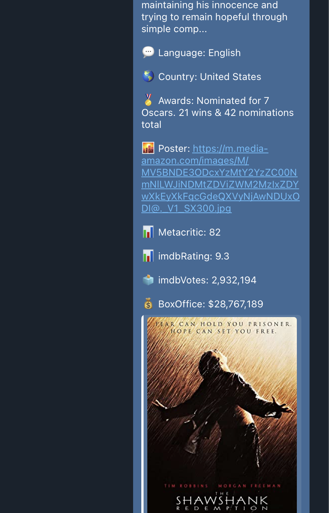

Find Movies and Series with **[@ShodamBot](https://t.me/shodambot)**

A telegram bot created using Python -> Python-telegram-bot library
 
 
# Features
1. More than 5000 movies and series exists in Database
2. New movies and series added daily (automated using cronjob and Bash script)
3. Direct Download Links
4. Different Qualities
5. Different Codecs
6. Log Search
7. Log Crawling and Extraction of Download Links
8. Inline-Query Search
9- Get Movie Informations such as IMDB rating, Plot, Director and ...

## Sample

Searching Movies/Series using Inline-Query Feature:

 

Getting Movies/Series Direct Download Links:

 

Getting Movies/Series Informations:

